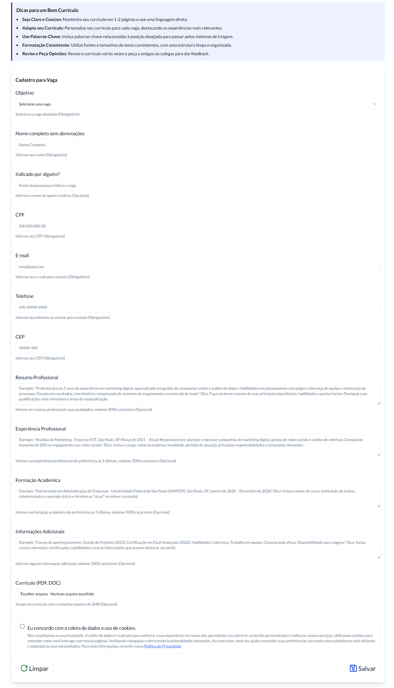
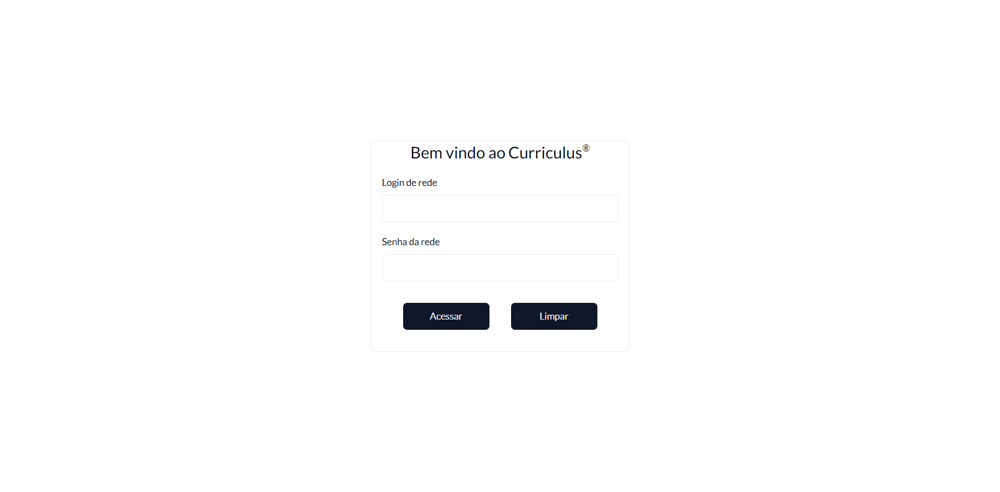
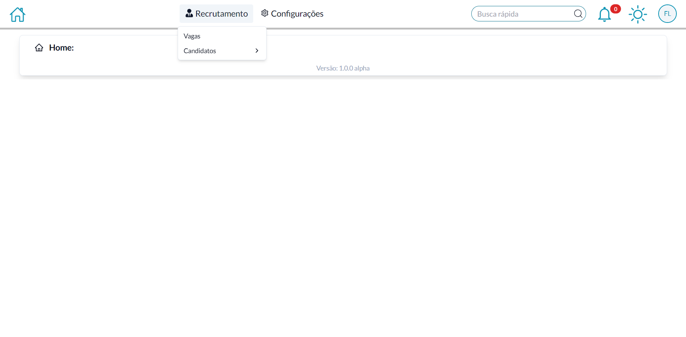
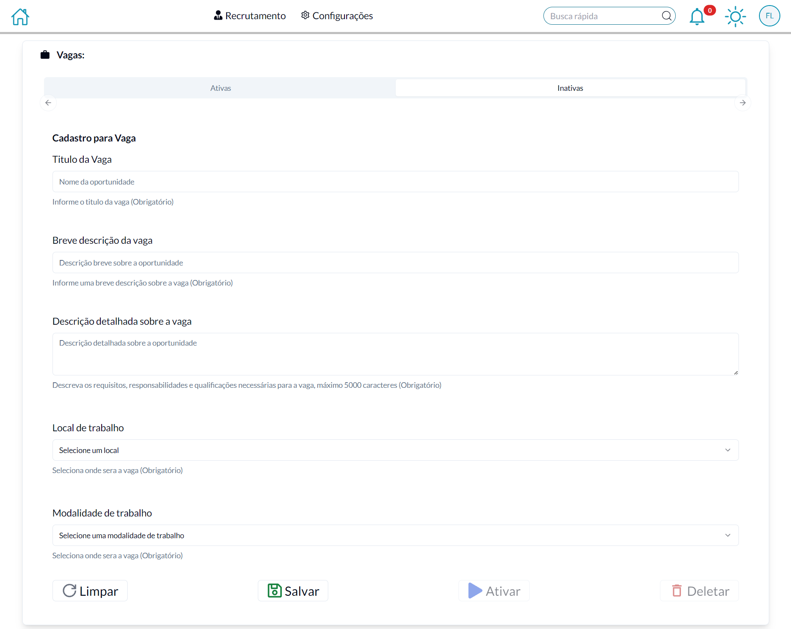
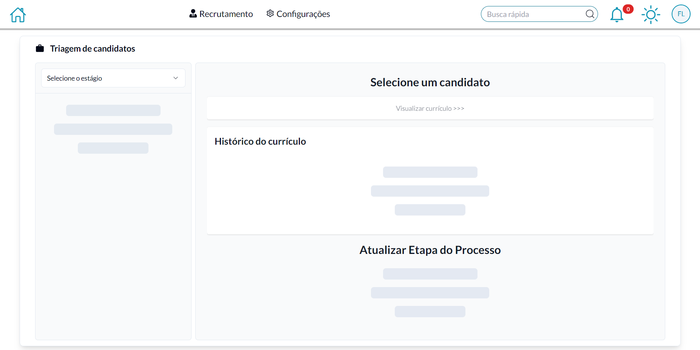
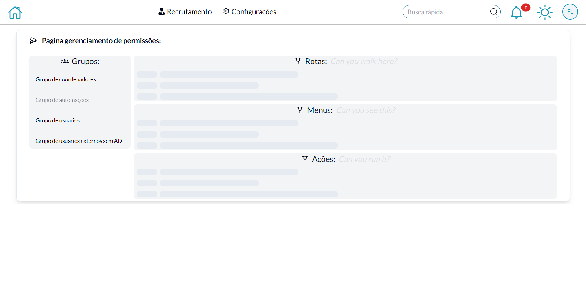

# Currículus

**Currículus** é um sistema desenvolvido para gerenciar o armazenamento de currículos e o cadastramento de vagas de emprego para uma empresa. Os candidatos podem se cadastrar na plataforma e ser avaliados pelos funcionários da empresa. Eles podem participar de uma ou mais vagas, desde que estejam disponíveis para candidatura.

***Nota importante: Para autenticação é usada uma api externa para integração com Active Directory.***

## Tecnologias Utilizadas

- **Backend**: [Laravel](https://laravel.com)
- **Frontend**: [Next.js](https://nextjs.org)
- **Banco de Dados**: [MariaDB](https://mariadb.org)
- **Sessões**: [Redis](https://redis.io)
- **Docker**: [Docker](https://www.docker.com)

## Estrutura do Projeto

O projeto é dividido nas seguintes partes:

- **Backend**: Código e lógica de negócio em Laravel na pasta `backend`.
- **Frontend**: Interface e páginas desenvolvidas com Next.js + tailwind na pasta `frontend`.
- **Configurações**: Arquivos de configuração estão na pasta `configs` para facilitar o setup do sistema.
- **Docker**: Os arquivos `Dockerfile` estão na pasta `configs` e `docker-compose`, são duas versões do mesmo arquivo para facilitar a criação e o gerenciamento dos ambientes de desenvolvimento e produção.

## Requisitos

- PHP 8.x ou superior
- Composer
- Node.js
- NPM
- Docker
- Mapeamento de rede (opcional)

## Instalação

### 1. Configuração do Ambiente Local

#### Desenvolvimento

##### Backend

```bash
docker compose -f docker-compose.development.yml up -d
```

##### Frontend

```bash
cd frontend
npm run dev
```

#### Produção

```bash
docker compose -f docker-compose.production.yml up -d
```

#### Banco de Dados

***Os bancos de dados não estão presentes nos arquivos docker files***

1. O sistema utiliza MariaDB. Configure o banco conforme o arquivo `.env.example` do backend.

#### Frontend Header e Footer

1. Na pasta `frontend\components\vacancies\register` crie os arquivos de titulo e rodape da pagina a seu gosto `footComponent.tsx` e `headComponent.tsx`.

### 2. Acessando a Aplicação

Após configurar o ambiente, a aplicação estará disponível em:

- **Frontend**: `http://localhost:3000`
- **Backend (API)**: `http://localhost:9000`
- **Swagger (API)**: `http://localhost:9000/v1/api/docs`

## Funcionalidades

- Cadastro e gerenciamento de candidatos
- Cadastro e gerenciamento de vagas de emprego
- Configurações de permissões do sistema

## Parte Visual

### Cadastro de currículo



### Página de login



### Página inicial



### Página para manuseio de vagas (sem dados)



### Página para manuseio de candidatos (sem dados)



### Página para manuseio de configurações (sem dados)



## Licença

Este projeto está licenciado sob a [MIT License](LICENSE).
